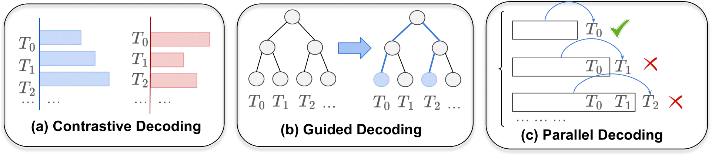

# Decoding Methods for Foundation Models: A Survey

[](https://arxiv.org/abs/000.0000)
[](https://awesome.re)


[](./LICENSE)


> 🔍 See our paper: [**"Decoding Methods for Foundation Models: A Survey"**](https://arxiv.org/abs/0000.0000) [](https://arxiv.org/abs/0000.0000)
>
> 📧 Please let us know if you find a mistake or have any suggestions by e-mail: <hwang219@hawk.iit.edu>

## 👂**TL;DR**

- Advanced decoding methods can enhance generation at inference time, providing an effective and efficient way to control outputs from LLMs and LVLMs.
- 🙋‍♂️ The [QuickStart](#quickstart) section offers an overview to help you quickly dive into learning about decoding methods.
- This [paper list](#papers) compiles relevant research on decoding methods for both LLMs and LVLMs.

## Table of Contents

- 💡 [About](#about)
- ✨ [Updates](#updates)
- 🔧 [QuickStart](#quickstart)
- 📑 [Papers](#papers)
  - [Related Survey](#survey)
  - [Paradigms](#paradigms)
    - [Contrastive Decoding](#contrastive)
    - [Guided Decoding](#guided)
    - [Parallel Decoding](#parallel)
  - [Applications](#applications)
    - [Improve Model Alignment](#improve-model-alignment)
    - [Improve Generation Tasks](#improve-generation-tasks)
    - [Improve Generation Efficiency](#improve-generation-efficiency)
    - [Domain-Specific Applications](#domain-specific-applications)
- 🔗 [Citation](#citation)

## About

In this paper, we survey and categorize research on decoding methods for foundation models along two key dimensions: paradigms and applications. We identify three primary paradigms in recent decoding algorithms for large generative models: **contrastive decoding**, **guided decoding**, and **parallel decoding**.

<div align="center">
</div>

## Updates

- 📄 [12/16/2024] Paper list has been released!

## QuickStart

-  [Neurips 2024 Tutorial: Beyond Decoding](https://cmu-l3.github.io/neurips2024-inference-tutorial/)
- []() [How to generate text: using different decoding methods for language generation with Transformers](https://huggingface.co/blog/how-to-generate)
- []() [Generating Human-level Text with Contrastive Search in Transformers](https://huggingface.co/blog/introducing-csearch)
- [Decoding Strategies in Large Language Models](https://mlabonne.github.io/blog/posts/2023-06-07-Decoding_strategies.html)
- []()  [CMU Neural Nets for NLP 2021 (18): Advanced Search Algorithms](https://www.youtube.com/watch?v=Gl6CPW6l6dA&ab_channel=GrahamNeubig)
- []()  [CMU Advanced NLP Fall 2024 (22): From Decoding to Meta Generation Inference Time Algorithms for LMs](https://www.youtube.com/watch?v=0s1gZe_BcQ0&ab_channel=GrahamNeubig)
- []()  [UMass CS685 S24 (Advanced NLP) #13: Decoding from language models](https://www.youtube.com/watch?v=WoJrlvu7ODI&t=3872s&ab_channel=MohitIyyer)
- []()  [CMU LTI Colloquium: Reasoning with Inference Time Compute](https://www.youtube.com/watch?v=lGr-O2rK7WQ&ab_channel=LanguageTechnologiesInstituteatCarnegieMellon%28LTIatCMU%29)
- []() [Speculative Decoding: When Two LLMs are Faster than One](https://www.youtube.com/watch?v=S-8yr_RibJ4&ab_channel=EfficientNLP)

## Papers

### Keywords Convention

Abbreviation: 
Conference: 
Model: 

### Survey

- **Comparison of Diverse Decoding Methods from Conditional Language Models**  
    *Daphne Ippolito, Reno Kriz, João Sedoc, Maria Kustikova, Chris Callison-Burch*
    [[pdf](https://aclanthology.org/P19-1365.pdf)]
    
    
- **On Decoding Strategies for Neural Text Generators**  
    *Gian Wiher, Clara Meister, Ryan Cotterell*
    [[pdf](https://aclanthology.org/2022.tacl-1.58.pdf)]
    
    
- **Unlocking Efficiency in Large Language Model Inference: A Comprehensive Survey of Speculative Decoding**
    *Heming Xia, Zhe Yang, Qingxiu Dong, Peiyi Wang, Yongqi Li, Tao Ge, Tianyu Liu, Wenjie Li, Zhifang Sui*
    [[pdf](https://aclanthology.org/2024.findings-acl.456.pdf)]
    
    
- **From Decoding to Meta-Generation: Inference-time Algorithms for Large Language Models**
    *Sean Welleck, Amanda Bertsch, Matthew Finlayson, Hailey Schoelkopf, Alex Xie, Graham Neubig, Ilia Kulikov, Zaid Harchaoui*
    [[pdf](https://arxiv.org/pdf/2406.16838)]
    
    
- **Controllable Text Generation for Large Language Models: A Survey**
    *Xun Liang, Hanyu Wang, Yezhaohui Wang, Shichao Song, Jiawei Yang, Simin Niu, Jie Hu, Dan Liu, Shunyu Yao, Feiyu Xiong, Zhiyu Li*
    [[pdf](https://arxiv.org/pdf/2408.12599)]
    

### Paradigms

#### Contrastive

- **DExperts: Decoding-Time Controlled Text Generation with Experts and Anti-Experts**  
    *Alisa Liu, Maarten Sap, Ximing Lu, Swabha Swayamdipta, Chandra Bhagavatula, Noah A. Smith, Yejin Choi*.
    [[pdf](https://aclanthology.org/2023.findings-emnlp.257.pdf)], [[code](https://github.com/alisawuffles/DExperts)]
    
    
    

- **Contrastive Decoding: Open-ended Text Generation as Optimization**  
    *Xiang Lisa Li, Ari Holtzman, Daniel Fried, Percy Liang, Jason Eisner, Tatsunori Hashimoto, Luke Zettlemoyer, Mike Lewis*.
    [[pdf](https://aclanthology.org/2023.acl-long.687.pdf)], [[code](https://github.com/XiangLi1999/ContrastiveDecoding)]
    
    
    

- **Trusting Your Evidence: Hallucinate Less with Context-aware Decoding**  
    *Weijia Shi, Xiaochuang Han, Mike Lewis, Yulia Tsvetkov, Luke Zettlemoyer, Wen-tau Yih*.
    [[pdf](https://aclanthology.org/2024.naacl-short.69.pdf)], [[code](https://github.com/xhan77/context-aware-decoding)]
    
    
    

- **Speculative Contrastive Decoding**  
    *Hongyi Yuan, Keming Lu, Fei Huang, Zheng Yuan, Chang Zhou*.
    [[pdf](https://aclanthology.org/2024.acl-short.5.pdf)]
    
    
    

- **DoLa: Decoding by Contrasting Layers Improves Factuality in Large Language Models**  
    *Yung-Sung Chuang, Yujia Xie, Hongyin Luo, Yoon Kim, James Glass, Pengcheng He*.
    [[pdf](https://arxiv.org/pdf/2309.03883)], [[code](https://github.com/voidism/DoLa)]
    
    
    

- **Mitigating Object Hallucinations in Large Vision-Language Models through Visual Contrastive Decoding**  
    *Sicong Leng, Hang Zhang, Guanzheng Chen, Xin Li, Shijian Lu, Chunyan Miao, Lidong Bing*.
    [[pdf](https://arxiv.org/pdf/2311.16922)], [[code](https://github.com/DAMO-NLP-SG/VCD)]
    
    
    

- **ROSE Doesn't Do That: Boosting the Safety of Instruction-Tuned Large Language Models with Reverse Prompt Contrastive Decoding**  
    *Qihuang Zhong, Liang Ding, Juhua Liu, Bo Du, Dacheng Tao*.
    [[pdf](https://aclanthology.org/2024.findings-acl.814.pdf)], [[code](https://github.com/WHU-ZQH/ROSE)]
    
    
    

- **Enhancing Contextual Understanding in Large Language Models through Contrastive Decoding**  
    *Zheng Zhao, Emilio Monti, Jens Lehmann, Haytham Assem*.
    [[pdf](https://aclanthology.org/2024.naacl-long.237.pdf)]
    
    

- **Entropy-Based Decoding for Retrieval-Augmented Large Language Models**  
    *Zexuan Qiu, Zijing Ou, Bin Wu, Jingjing Li, Aiwei Liu, Irwin King*.
    [[pdf](https://arxiv.org/pdf/2406.17519)]
    
    

- **Adaptive Contrastive Decoding in Retrieval-Augmented Generation for Handling Noisy Contexts**  
    *Youna Kim, Hyuhng Joon Kim, Cheonbok Park, Choonghyun Park, Hyunsoo Cho, Junyeob Kim, Kang Min Yoo, Sang-goo Lee, Taeuk Kim*.
    [[pdf](https://aclanthology.org/2024.findings-emnlp.136.pdf)]
    
    
    

- **Unchosen Experts Can Contribute Too: Unleashing MoE Models' Power by Self-Contrast**  
    *Chufan Shi, Cheng Yang, Xinyu Zhu, Jiahao Wang, Taiqiang Wu, Siheng Li, Deng Cai, Yujiu Yang, Yu Meng*.
    [[pdf](https://arxiv.org/pdf/2405.14507v1)], [[code](https://github.com/DavidFanzz/SCMoE)]
    
    

- **Entropy Guided Extrapolative Decoding to Improve Factuality in Large Language Models**  
    *Souvik Das, Lifeng Jin, Linfeng Song, Haitao Mi, Baolin Peng, Dong Yu*.
    [[pdf](https://arxiv.org/pdf/2404.09338)], [[code](https://github.com/souvikdgp16/extrapolative_decoding)]
    

- **Mitigating Hallucinations in Large Vision-Language Models with Instruction Contrastive Decoding**  
    *Xintong Wang, Jingheng Pan, Liang Ding, Chris Biemann*.
    [[pdf](https://aclanthology.org/2024.findings-acl.937.pdf)]
    
    

- **IBD: Alleviating Hallucinations in Large Vision-Language Models via Image-Biased Decoding**  
    *Lanyun Zhu, Deyi Ji, Tianrun Chen, Peng Xu, Jieping Ye, Jun Liu*.
    [[pdf](https://arxiv.org/pdf/2402.18476)]
    
    

- **VACoDe: Visual Augmented Contrastive Decoding**  
    *Sihyeon Kim, Boryeong Cho, Sangmin Bae, Sumyeong Ahn, Se-Young Yun*.
    [[pdf](https://arxiv.org/pdf/2408.05337)]
    
    

- **VaLiD: Mitigating the Hallucination of Large Vision Language Models by Visual Layer Fusion Contrastive Decoding**  
    *Jiaqi Wang, Yifei Gao, Jitao Sang*.
    [[pdf](https://arxiv.org/pdf/2411.15839)]
    
    

- **Mitigating Hallucinations in Large Vision-Language Models (LVLMs) via Language-Contrastive Decoding (LCD)**  
    *Avshalom Manevich, Reut Tsarfaty*.
    [[pdf](https://aclanthology.org/2024.findings-acl.359.pdf)]
    
    
    

#### Guided

- **NeuroLogic Decoding: (Un)supervised Neural Text Generation with Predicate Logic Constraints**  
    *Ximing Lu, Peter West, Rowan Zellers, Ronan Le Bras, Chandra Bhagavatula, Yejin Choi*.
    [[pdf](https://aclanthology.org/2021.naacl-main.339.pdf)]
    
    

- **FUDGE: Controlled Text Generation With Future Discriminators**  
    *Kevin Yang, Dan Klein*.
    [[pdf](https://aclanthology.org/2021.naacl-main.276.pdf)], [[code](https://github.com/yangkevin2/naacl-2021-fudge-controlled-generation)]
    
    
    

- **NeuroLogic A*esque Decoding: Constrained Text Generation with Lookahead Heuristics**  
    *Ximing Lu, Sean Welleck, Peter West, Liwei Jiang, Jungo Kasai, Daniel Khashabi, Ronan Le Bras, Lianhui Qin, Youngjae Yu, Rowan Zellers, Noah A. Smith, Yejin Choi*.
    [[pdf](https://aclanthology.org/2022.naacl-main.57.pdf)]
    
    

- **Critic-Guided Decoding for Controlled Text Generation**  
    *Minbeom Kim, Hwanhee Lee, Kang Min Yoo, Joonsuk Park, Hwaran Lee, Kyomin Jung*.
    [[pdf](https://aclanthology.org/2023.findings-acl.281.pdf)], [[code](https://github.com/minbeomkim/CriticControl)]
    
    
    

- **NaturalProver: Grounded Mathematical Proof Generation with Language Models**  
    *Sean Welleck, Jiacheng Liu, Ximing Lu, Hannaneh Hajishirzi, Yejin Choi*.
    [[pdf](https://arxiv.org/pdf/2205.12910)], [[code](https://github.com/wellecks/naturalprover)]
    
    
    

- **MIL-Decoding: Detoxifying Language Models at Token-Level via Multiple Instance Learning**  
    *Xu Zhang, Xiaojun Wan*.
    [[pdf](https://aclanthology.org/2023.acl-long.11.pdf)]
    
    
    

- **Reward-Augmented Decoding: Efficient Controlled Text Generation With a Unidirectional Reward Model**  
    *Haikang Deng, Colin Raffel*.
    [[pdf](https://aclanthology.org/2023.emnlp-main.721.pdf)]
    
    
    

- **Don't throw away your value model! Generating more preferable text with Value-Guided Monte-Carlo Tree Search decoding**  
    *Jiacheng Liu, Andrew Cohen, Ramakanth Pasunuru, Yejin Choi, Hannaneh Hajishirzi, Asli Celikyilmaz*.
    [[pdf](https://arxiv.org/pdf/2309.15028)]
    
    

- **Planning with Large Language Models for Code Generation**  
    *Shun Zhang, Zhenfang Chen, Yikang Shen, Mingyu Ding, Joshua B. Tenenbaum, Chuang Gan*.
    [[pdf](https://arxiv.org/pdf/2303.05510)], [[code](https://codeaimcts.github.io/)]
    
    
    

- **Seeing is Believing: Mitigating Hallucination in Large Vision-Language Models via CLIP-Guided Decoding**  
    *Ailin Deng, Zhirui Chen, Bryan Hooi*.
    [[pdf](https://arxiv.org/pdf/2402.15300)], [[code](https://github.com/d-ailin/CLIP-Guided-Decoding)]
    
    

- **Deductive Beam Search: Decoding Deducible Rationale for Chain-of-Thought Reasoning**  
    *Tinghui Zhu, Kai Zhang, Jian Xie, Yu Su*.
    [[pdf](https://arxiv.org/pdf/2401.17686)], [[code](https://github.com/OSU-NLP-Group/Deductive-Beam-Search)]
    
    
    

- **A Data-Driven Guided Decoding Mechanism for Diagnostic Captioning**  
    *Panagiotis Kaliosis, John Pavlopoulos, Foivos Charalampakos, Georgios Moschovis, Ion Androutsopoulos*.
    [[pdf](https://aclanthology.org/2024.findings-acl.444.pdf)], [[code](https://github.com/nlpaueb/dmmcs)]
    
    
    

- **Mitigating Hallucinations in Large Vision-Language Models via Summary-Guided Decoding**  
    *Kyungmin Min, Minbeom Kim, Kang-il Lee, Dongryeol Lee, Kyomin Jung*.
    [[pdf](https://arxiv.org/pdf/2410.13321)]
    
    

- **Self-Introspective Decoding: Alleviating Hallucinations for Large Vision-Language Models**  
    *Fushuo Huo, Wenchao Xu, Zhong Zhang, Haozhao Wang, Zhicheng Chen, Peilin Zhao*.
    [[pdf](https://arxiv.org/pdf/2408.02032)], [[code](https://github.com/huofushuo/SID)]
    
    

- **Alphazero-like Tree-Search can Guide Large Language Model Decoding and Training**  
    *Xidong Feng, Ziyu Wan, Muning Wen, Stephen Marcus McAleer, Ying Wen, Weinan Zhang, Jun Wang*.
    [[pdf](https://arxiv.org/pdf/2309.17179)], [[code](https://github.com/waterhorse1/LLM_Tree_Search)]
    
    

- **From Uncertainty to Trust: Enhancing Reliability in Vision-Language Models with Uncertainty-Guided Dropout Decoding**  
    *Yixiong Fang, Ziran Yang, Zhaorun Chen, Zhuokai Zhao, Jiawei Zhou*.
    [[pdf](https://arxiv.org/pdf/2412.06474)], [[code](https://github.com/kigb/DropoutDecoding)]
    
    

- **Monitor-Guided Decoding of Code LMs with Static Analysis of Repository Context**  
    *Lakshya A Agrawal, Aditya Kanade, Navin Goyal, Shuvendu K. Lahiri, Sriram K. Rajamani*.
    [[pdf](https://proceedings.neurips.cc/paper_files/paper/2023/file/662b1774ba8845fc1fa3d1fc0177ceeb-Paper-Conference.pdf)], [[code](https://github.com/microsoft/monitors4codegen)]
    
    
    

- **SafeDecoding: Defending against Jailbreak Attacks via Safety-Aware Decoding**  
    *Zhangchen Xu, Fengqing Jiang, Luyao Niu, Jinyuan Jia, Bill Yuchen Lin, Radha Poovendran*.
    [[pdf](https://aclanthology.org/2024.acl-long.303.pdf)], [[code](https://github.com/uw-nsl/SafeDecoding)]
    
    
    

- **Guiding LLMs The Right Way: Fast, Non-Invasive Constrained Generation**  
    *Luca Beurer-Kellner, Marc Fischer, Martin Vechev*.
    [[pdf](https://arxiv.org/pdf/2403.06988v1)], [[code](https://github.com/eth-sri/domino)]
    
    
    

#### Parallel

- **Blockwise Parallel Decoding for Deep Autoregressive Models**  
    *Mitchell Stern, Noam Shazeer, Jakob Uszkoreit*.
    [[pdf](https://proceedings.neurips.cc/paper_files/paper/2018/file/c4127b9194fe8562c64dc0f5bf2c93bc-Paper.pdf)]
    
    
    

- **Speculative Decoding: Exploiting Speculative Execution for Accelerating Seq2seq Generation**  
    *Heming Xia, Tao Ge, Peiyi Wang, Si-Qing Chen, Furu Wei, Zhifang Sui*.
    [[pdf](https://aclanthology.org/2023.findings-emnlp.257.pdf)], [[code](https://github.com/hemingkx/SpecDec)]
    
    
    

- **Accelerating Transformer Inference for Translation via Parallel Decoding**  
    *Andrea Santilli, Silvio Severino, Emilian Postolache, Valentino Maiorca, Michele Mancusi, Riccardo Marin, Emanuele Rodolà*.
    [[pdf](https://aclanthology.org/2023.acl-long.689.pdf)], [[code](https://github.com/teelinsan/parallel-decoding)]
    
    

- **Draft& Verify: Lossless Large Language Model Acceleration via Self-Speculative Decoding**  
    *Jun Zhang, Jue Wang, Huan Li, Lidan Shou, Ke Chen, Gang Chen, Sharad Mehrotra*.
    [[pdf](https://aclanthology.org/2024.acl-long.607.pdf)], [[code](https://github.com/dilab-zju/self-speculative-decoding)]
    
    
    

- **Fast Inference from Transformers via Speculative Decoding**  
    *Yaniv Leviathan, Matan Kalman, Yossi Matias*.
    [[pdf](https://arxiv.org/pdf/2211.17192)]
    
    

- **Accelerating Large Language Model Decoding with Speculative Sampling**  
    *Charlie Chen, Sebastian Borgeaud, Geoffrey Irving, Jean-Baptiste Lespiau, Laurent Sifre, John Jumper*.
    [[pdf](https://arxiv.org/pdf/2302.01318)]
    

- **DistillSpec: Improving Speculative Decoding via Knowledge Distillation**  
    *Yongchao Zhou, Kaifeng Lyu, Ankit Singh Rawat, Aditya Krishna Menon, Afshin Rostamizadeh, Sanjiv Kumar, Jean-François Kagy, Rishabh Agarwal*.
    [[pdf](https://arxiv.org/pdf/2310.08461)]
    
    
    

- **SpecInfer: Accelerating Generative Large Language Model Serving with Tree-based Speculative Inference and Verification**  
    *Xupeng Miao, Gabriele Oliaro, Zhihao Zhang, Xinhao Cheng, Zeyu Wang, Zhengxin Zhang, Rae Ying Yee Wong, Alan Zhu, Lijie Yang, Xiaoxiang Shi, Chunan Shi, Zhuoming Chen, Daiyaan Arfeen, Reyna Abhyankar, Zhihao Jia*.
    [[pdf](https://arxiv.org/pdf/2305.09781)], [[code](https://github.com/flexflow/flexflow-train)]
    
    
    

- **Online Speculative Decoding**  
    *Xiaoxuan Liu, Lanxiang Hu, Peter Bailis, Alvin Cheung, Zhijie Deng, Ion Stoica, Hao Zhang*.
    [[pdf](https://arxiv.org/pdf/2310.07177)], [[code](https://github.com/LiuXiaoxuanPKU/OSD)]
    
    
    

- **Speculative RAG: Enhancing Retrieval Augmented Generation through Drafting**  
    *Zilong Wang, Zifeng Wang, Long Le, Huaixiu Steven Zheng, Swaroop Mishra, Vincent Perot, Yuwei Zhang, Anush Mattapalli, Ankur Taly, Jingbo Shang, Chen-Yu Lee, Tomas Pfister*.
    [[pdf](https://arxiv.org/pdf/2407.08223)]
    
    

- **Break the Sequential Dependency of LLM Inference Using Lookahead Decoding**  
    *Yichao Fu, Peter Bailis, Ion Stoica, Hao Zhang*.
    [[pdf](https://arxiv.org/pdf/2402.02057)], [[code](https://github.com/hao-ai-lab/LookaheadDecoding)]
    
    

- **Medusa: Simple LLM Inference Acceleration Framework with Multiple Decoding Heads**  
    *Tianle Cai, Yuhong Li, Zhengyang Geng, Hongwu Peng, Jason D. Lee, Deming Chen, Tri Dao*.
    [[pdf](https://arxiv.org/pdf/2401.10774)], [[code](https://github.com/FasterDecoding/Medusa)]
    
    
    

- **EAGLE: Speculative Sampling Requires Rethinking Feature Uncertainty**  
    *Yuhui Li, Fangyun Wei, Chao Zhang, Hongyang Zhang*.
    [[pdf](https://arxiv.org/pdf/2401.15077)], [[code](https://github.com/SafeAILab/EAGLE)]
    
    
    

- **EAGLE-2: Faster Inference of Language Models with Dynamic Draft Trees**  
    *Yuhui Li, Fangyun Wei, Chao Zhang, Hongyang Zhang*.
    [[pdf](https://arxiv.org/pdf/2406.16858)], [[code](https://github.com/SafeAILab/EAGLE)]
    
    
    

- **On Speculative Decoding for Multimodal Large Language Models**  
    *Mukul Gagrani, Raghavv Goel, Wonseok Jeon, Junyoung Park, Mingu Lee, Christopher Lott*.
    [[pdf](https://arxiv.org/pdf/2404.08856)]
    

- **LANTERN: Accelerating Visual Autoregressive Models with Relaxed Speculative Decoding**  
    *Doohyuk Jang, Sihwan Park, June Yong Yang, Yeonsung Jung, Jihun Yun, Souvik Kundu, Sung-Yub Kim, Eunho Yang*.
    [[pdf](https://arxiv.org/pdf/2410.03355v1)]
    
    

- **Accelerating Auto-regressive Text-to-Image Generation with Training-free Speculative Jacobi Decoding**  
    *Yao Teng, Han Shi, Xian Liu, Xuefei Ning, Guohao Dai, Yu Wang, Zhenguo Li, Xihui Liu*.
    [[pdf](https://arxiv.org/pdf/2410.01699)]
    
    

- **Superposed Decoding: Multiple Generations from a Single Autoregressive Inference Pass**  
    *Ethan Shen, Alan Fan, Sarah M. Pratt, Jae Sung Park, Matthew Wallingford, Sham M. Kakade, Ari Holtzman, Ranjay Krishna, Ali Farhadi, Aditya Kusupati*.
    [[pdf](https://arxiv.org/pdf/2405.18400)], [[code](https://github.com/RAIVNLab/SuperposedDecoding)]
    
    
    

### Applications

#### Improve Model Alignment

##### Mitigate Hallucination

- **DeCoRe: Decoding by Contrasting Retrieval Heads to Mitigate Hallucinations**  
    *Aryo Pradipta Gema, Chen Jin, Ahmed Abdulaal, Tom Diethe, Philip Teare, Beatrice Alex, Pasquale Minervini, Amrutha Saseendran*.
    [[pdf](https://arxiv.org/pdf/2410.18860)], [[code](https://github.com/aryopg/DeCoRe)]
    
    

- **Improving Factuality in Large Language Models via Decoding-Time Hallucinatory and Truthful Comparators**  
    *Dingkang Yang, Dongling Xiao, Jinjie Wei, Mingcheng Li, Zhaoyu Chen, Ke Li, Lihua Zhang*.
    [[pdf](https://arxiv.org/pdf/2408.12325v1)]
    
    

- **Delve into Visual Contrastive Decoding for Hallucination Mitigation of Large Vision-Language Models**  
    *Yi-Lun Lee, Yi-Hsuan Tsai, Wei-Chen Chiu*.
    [[pdf](https://arxiv.org/pdf/2412.06775)], [[code](https://github.com/YiLunLee/VCD_Analysis)]
    

- **ConVis: Contrastive Decoding with Hallucination Visualization for Mitigating Hallucinations in Multimodal Large Language Models**  
    *Yeji Park, Deokyeong Lee, Junsuk Choe, Buru Chang*.
    [[pdf](https://arxiv.org/pdf/2408.13906)], [[code](https://github.com/yejipark-m/ConVis)]
    
    

- **MLLM can see? Dynamic Correction Decoding for Hallucination Mitigation**  
    *Chenxi Wang, Xiang Chen, Ningyu Zhang, Bozhong Tian, Haoming Xu, Shumin Deng, Huajun Chen*.
    [[pdf](https://arxiv.org/pdf/2410.11779)], [[code](https://github.com/zjunlp/DeCo)]
    
    

- **CATCH: Complementary Adaptive Token-level Contrastive Decoding to Mitigate Hallucinations in LVLMs**  
    *Zhehan Kan, Ce Zhang, Zihan Liao, Yapeng Tian, Wenming Yang, Junyuan Xiao, Xu Li, Dongmei Jiang, Yaowei Wang, Qingmin Liao*.
    [[pdf](https://arxiv.org/pdf/2411.12713)]
    
    

##### Improve Safety

- **SafeInfer: Context Adaptive Decoding Time Safety Alignment for Large Language Models**  
    *Somnath Banerjee, Sayan Layek, Soham Tripathy, Shanu Kumar, Animesh Mukherjee, Rima Hazra*.
    [[pdf](https://arxiv.org/pdf/2406.12274)], [[code](https://github.com/NeuralSentinel/SafeInfer)]
    
    
    

- **Adversarial Contrastive Decoding: Boosting Safety Alignment of Large Language Models via Opposite Prompt Optimization**  
    *Zhengyue Zhao, Xiaoyun Zhang, Kaidi Xu, Xing Hu, Rui Zhang, Zidong Du, Qi Guo, Yunji Chen*.
    [[pdf](https://arxiv.org/pdf/2406.16743)]
    
    

- **Adversarial Contrastive Decoding: Boosting Safety Alignment of Large Language Models via Opposite Prompt Optimization**  
    *Zhengyue Zhao, Xiaoyun Zhang, Kaidi Xu, Xing Hu, Rui Zhang, Zidong Du, Qi Guo, Yunji Chen*.
    [[pdf](https://arxiv.org/pdf/2406.16743)]
    
    

- **Root Defence Strategies: Ensuring Safety of LLM at the Decoding Level**  
    *Xinyi Zeng, Yuying Shang, Yutao Zhu, Jiawei Chen, Yu Tian*.
    [[pdf](https://arxiv.org/pdf/2410.06809)]
    

- **Probing the Safety Response Boundary of Large Language Models via Unsafe Decoding Path Generation**  
    *Haoyu Wang, Bingzhe Wu, Yatao Bian, Yongzhe Chang, Xueqian Wang, Peilin Zhao*.
    [[pdf](https://arxiv.org/pdf/2408.10668v1)]
    
    

- **Parameter-Efficient Detoxification with Contrastive Decoding**  
    *Tong Niu, Caiming Xiong, Yingbo Zhou, Semih Yavuz*.
    [[pdf](https://aclanthology.org/2024.hucllm-1.3.pdf)]
    
    

##### Improve Reasoning

- **Contrastive Decoding Improves Reasoning in Large Language Models**  
    *Sean O'Brien, Mike Lewis*.
    [[pdf](https://arxiv.org/pdf/2309.09117)]
    

- **Distillation Contrastive Decoding: Improving LLMs Reasoning with Contrastive Decoding and Distillation**  
    *Phuc Phan, Hieu Tran, Long Phan*.
    [[pdf](https://arxiv.org/pdf/2402.14874)], [[code](https://github.com/pphuc25/distil-cd)]
    
    

- **Expediting and Elevating Large Language Model Reasoning via Hidden Chain-of-Thought Decoding**  
    *Tianqiao Liu, Zui Chen, Zitao Liu, Mi Tian, Weiqi Luo*.
    [[pdf](https://arxiv.org/pdf/2409.08561)]
    

- **SEED: Accelerating Reasoning Tree Construction via Scheduled Speculative Decoding**  
    *Zhenglin Wang, Jialong Wu, Yilong Lai, Congzhi Zhang, Deyu Zhou*.
    [[pdf](https://arxiv.org/pdf/2406.18200)], [[code](https://github.com/Linking-ai/SEED)]
    
    

- **Chain-of-Thought Reasoning Without Prompting**  
    *Xuezhi Wang, Denny Zhou*.
    [[pdf](https://arxiv.org/pdf/2402.10200)]
    

- **Self-Para-Consistency: Improving Reasoning Tasks at Low Cost for Large Language Models**  
    *Wenqing Chen, Weicheng Wang, Zhixuan Chu, Kui Ren, Zibin Zheng, Zhichao Lu*.
    [[pdf](https://aclanthology.org/2024.findings-acl.842.pdf)], [[code](https://github.com/Linking-ai/SEED)]
    
    

- **Self-Evaluation Guided Beam Search for Reasoning**  
    *Yuxi Xie, Kenji Kawaguchi, Yiran Zhao, Xu Zhao, Min-Yen Kan, Junxian He, Qizhe Xie*.
    [[pdf](https://arxiv.org/pdf/2305.00633)], [[code](https://guideddecoding.github.io/)]
    
    

#### Improve Generation Tasks

##### RAG

- **REST: Retrieval-Based Speculative Decoding**  
    *Zhenyu He, Zexuan Zhong, Tianle Cai, Jason Lee, Di He*.
    [[pdf](https://aclanthology.org/2024.naacl-long.88.pdf)], [[code](https://github.com/FasterDecoding/REST)]
    
    
    

- **Nonparametric Decoding for Generative Retrieval**  
    *Hyunji Lee, JaeYoung Kim, Hoyeon Chang, Hanseok Oh, Sohee Yang, Vladimir Karpukhin, Yi Lu, Minjoon Seo*.
    [[pdf](https://aclanthology.org/2023.findings-acl.801.pdf)], [[code](https://github.com/amy-hyunji/Contextualized-Generative-Retrieval)]
    
    

- **Planning Ahead in Generative Retrieval: Guiding Autoregressive Generation through Simultaneous Decoding**  
    *Hansi Zeng, Chen Luo, Hamed Zamani*.
    [[pdf](https://dl.acm.org/doi/pdf/10.1145/3626772.3657746)], [[code](https://github.com/HansiZeng/PAG)]
    
    
    

##### Code Generation

- **DOCE: Finding the Sweet Spot for Execution-Based Code Generation**  
    *Haau-Sing Li, Patrick Fernandes, Iryna Gurevych, André F.T. Martins*.
    [[pdf](https://arxiv.org/pdf/2408.13745)], [[code](https://arxiv.org/pdf/2408.13745)]
    
    

- **USCD : Improving Code Generation of LLMs by Uncertainty-Aware Selective Contrastive Decoding**  
    *Shuai Wang, Liang Ding, Li Shen, Yong Luo, Zheng He, Wei Yu, Dacheng Tao*.
    [[pdf](https://arxiv.org/pdf/2409.05923)]
    
    

- **Selective Prompt Anchoring for Code Generation**  
    *Yuan Tian, Tianyi Zhang*.
    [[pdf](https://arxiv.org/pdf/2408.09121)], [[code](https://github.com/magic-YuanTian/Selective-Prompt-Anchoring)]
    
    

- **DocCGen: Document-based Controlled Code Generation**  
    *Sameer Pimparkhede, Mehant Kammakomati, Srikanth G. Tamilselvam, Prince Kumar, Ashok Pon Kumar, Pushpak Bhattacharyya*.
    [[pdf](https://aclanthology.org/2024.emnlp-main.1040.pdf)], [[code](https://github.com/sameerp30/Structured-generation)]
    
    
    

- **Constrained Decoding for Secure Code Generation**  
    *Yanjun Fu, Ethan Baker, Yu Ding, Yizheng Chen*.
    [[pdf](https://arxiv.org/pdf/2405.00218)]
    

- **Hot or Cold? Adaptive Temperature Sampling for Code Generation with Large Language Models**  
    *Yuqi Zhu, Jia Li, Ge Li, YunFei Zhao, Jia Li, Zhi Jin, Hong Mei*.
    [[pdf](https://arxiv.org/pdf/2309.02772)], [[code](https://github.com/LJ2lijia/AdapT)]
    
    
    

- **LEVER: Learning to Verify Language-to-Code Generation with Execution**  
    *Ansong Ni, Srini Iyer, Dragomir Radev, Ves Stoyanov, Wen-tau Yih, Sida I. Wang, Xi Victoria Lin*.
    [[pdf](https://proceedings.mlr.press/v202/ni23b/ni23b.pdf)], [[code](https://github.com/niansong1996/lever)]
    
    
    

- **Decoding Secret Memorization in Code LLMs Through Token-Level Characterization**  
    *Yuqing Nie, Chong Wang, Kailong Wang, Guoai Xu, Guosheng Xu, Haoyu Wang*.
    [[pdf](https://arxiv.org/pdf/2410.08858)]
    
    

#### Improve Generation Efficiency

##### Text Generation

- **Hierarchical Skip Decoding for Efficient Autoregressive Text Generation**  
    *Yunqi Zhu, Xuebing Yang, Yuanyuan Wu, Wensheng Zhang*.
    [[pdf](https://arxiv.org/pdf/2403.14919)]
    
    

- **A Frustratingly Simple Decoding Method for Neural Text Generation**  
    *Haoran Yang, Deng Cai, Huayang Li, Wei Bi, Wai Lam, Shuming Shi*.
    [[pdf](https://aclanthology.org/2024.lrec-main.47.pdf)], [[code](https://github.com/LHRYANG/FSD)]
    
    
    

- **Adaptive Draft-Verification for Efficient Large Language Model Decoding**  
    *Xukun Liu, Bowen Lei, Ruqi Zhang, Dongkuan Xu*.
    [[pdf](https://arxiv.org/pdf/2407.12021)]
    
    

##### Image Generation

- **Accelerating Auto-regressive Text-to-Image Generation with Training-free Speculative Jacobi Decoding**  
    *Yao Teng, Han Shi, Xian Liu, Xuefei Ning, Guohao Dai, Yu Wang, Zhenguo Li, Xihui Liu*.
    [[pdf](https://arxiv.org/pdf/2410.01699)]
    
    

- **Emage: Non-Autoregressive Text-to-Image Generation**  
    *Zhangyin Feng, Runyi Hu, Liangxin Liu, Fan Zhang, Duyu Tang, Yong Dai, Xiaocheng Feng, Jiwei Li, Bing Qin, Shuming Shi*.
    [[pdf](https://arxiv.org/pdf/2312.14988)]
    
    

- **HART: Efficient Visual Generation with Hybrid Autoregressive Transformer**  
    *Haotian Tang, Yecheng Wu, Shang Yang, Enze Xie, Junsong Chen, Junyu Chen, Zhuoyang Zhang, Han Cai, Yao Lu, Song Han*.
    [[pdf](https://arxiv.org/pdf/2410.10812)], [[code](https://github.com/mit-han-lab/hart)]
    
    

#### Domain-Specific Applications

##### Healthcare

- **Mitigating Hallucinations of Large Language Models in Medical Information Extraction via Contrastive Decoding**  
    *Derong Xu, Ziheng Zhang, Zhihong Zhu, Zhenxi Lin, Qidong Liu, Xian Wu, Tong Xu, Xiangyu Zhao, Yefeng Zheng, Enhong Chen*.
    [[pdf](https://aclanthology.org/2024.findings-emnlp.456.pdf)], [[code](https://github.com/quqxui/quqxui-AlternateCD)]
    
    
    

##### Robotics

- **Grounded Decoding: Guiding Text Generation with Grounded Models for Embodied Agents**  
    *Wenlong Huang, Fei Xia, Dhruv Shah, Danny Driess, Andy Zeng, Yao Lu, Pete Florence, Igor Mordatch, Sergey Levine, Karol Hausman, Brian Ichter*.
    [[pdf](https://arxiv.org/pdf/2303.00855)], [[code](https://grounded-decoding.github.io/)]
    
    
    

- **Bidirectional Decoding: Improving Action Chunking via Closed-Loop Resampling**  
    *Yuejiang Liu, Jubayer Ibn Hamid, Annie Xie, Yoonho Lee, Maximilian Du, Chelsea Finn*.
    [[pdf](https://arxiv.org/pdf/2408.17355)], [[code](https://bid-robot.github.io/)]
    
    

## Contributing to this paper list

- There are cases where we miss important works in this field, please feel free to contribute and promote your awesome work or other related works here! Thanks for the efforts in advance.

## **⏰ TODO in Coming Versions**

- [ ] Release decoding playground on HuggingFace

## Citation

If you find the resources in this repository useful, please cite our paper:

```
@inproceedings{wang2024decoding,
  title={Decoding Methods for Foundation Models: A Survey},
  author={Haoran Wang and Kai Shu.},
  booktitle={arXiv},
  year={2024}
}
```
